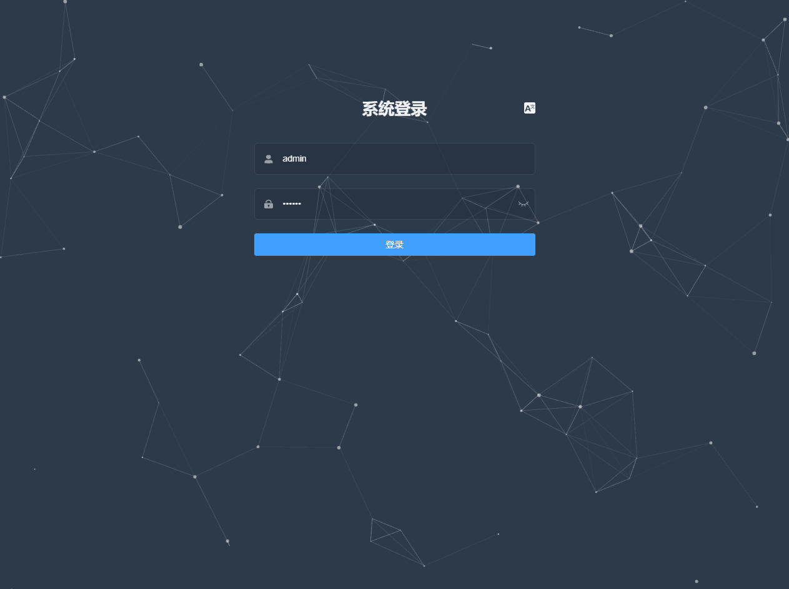
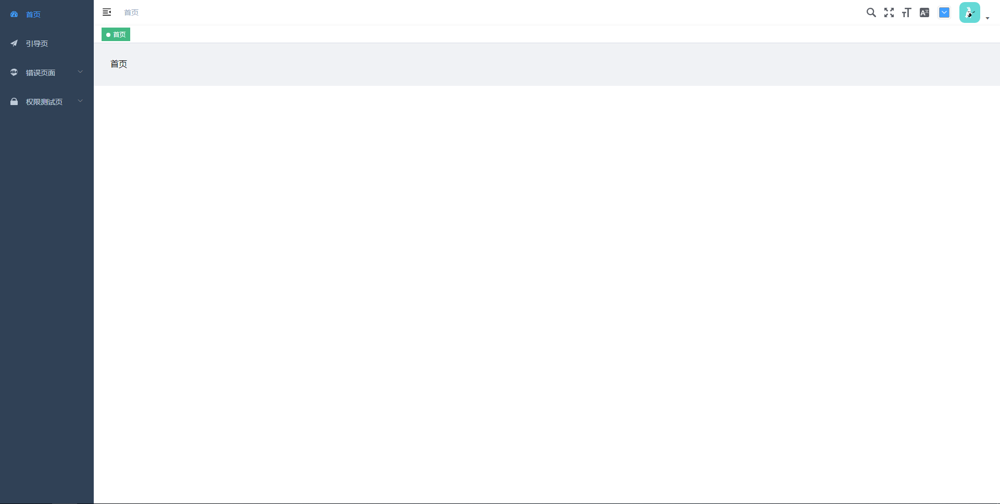

# pure_admin

简体中文 | [English](./README-en-US.md)

## 项目描述

简化官方项目[vue-element-admin](https://github.com/PanJiaChen/vue-element-admin)后台模版

## 项目展示

[演示](https://liuyongjin.github.io/show_admin/#/login)

## 项目启动

```bash
# clone the project
git clone https://github.com/liuyongjin/pure_admin.git

# enter the project directory
cd pure_admin

# install dependency
npm install

# develop
npm run serve
```

### 官方地址

[vue-element-admin](https://panjiachen.github.io/vue-element-admin-site/zh/guide).


## 项目截图






## License

[MIT](./LICENSE)
